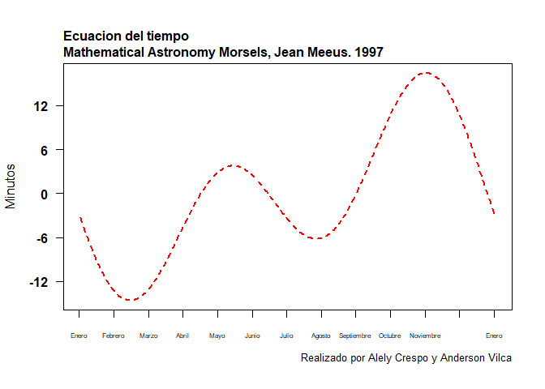

Tarea 2 Ejercicios
================
Anderson Vilca & Alely Crespo
25/11/2021

# Ejercicios

## Ejercicio 1

### ¿Qué cantidad de dinero sobra al repartir 10000 $ entre 3 personas?

``` r
dinero_sobrante <- 10000 %% 3
dinero_sobrante  # Es lo que sobra al repartir 10000 $ entre 3 personas
```

    ## [1] 1

## Ejercicio 2

### ¿Es el número 4560 divisible por 3?

``` r
4560 %% 3  # Si es divisible por 3 porque su residuo es 0
```

    ## [1] 0

## Ejercicio 3

### Construya un vector con los números enteros del 2 al 87. ¿Cuáles de esos números son divisibles por 7?

``` r
vec <- c(2:87)
vec [ vec %% 7 == 0 ]
```

    ##  [1]  7 14 21 28 35 42 49 56 63 70 77 84

``` r
# Nos sale  12 números divisibles por 7 ya que su residuo es 0.
```

## Ejercicio 4

### Construya dos vectores, el primero con los números enteros desde 7 hasta 3, el segundo vector con los primeros cinco números positivos divisibles por 5.

``` r
vec1<- c(7:3)
vec2<-c(seq(from=5, to=25, by=5))
condiA <- ifelse(vec1%%2==0, "TRUE", "FALSE")
condiB <- ifelse(vec2>10, "TRUE", "FALSE")
data.frame(condiA,condiB)
```

    ##   condiA condiB
    ## 1  FALSE  FALSE
    ## 2   TRUE  FALSE
    ## 3  FALSE   TRUE
    ## 4   TRUE   TRUE
    ## 5  FALSE   TRUE

``` r
# En la cuarta posicion se cumplen ambas condiciones
```

## Ejercicio 5

### Consulte este link en el cual hay una anécdota de Gauss niño. Use R para obtener el resultado de la suma solicitada por el profesor del niño Gauss.

``` r
g <- (1:100)
sum(1:100)
```

    ## [1] 5050

#### Otra forma

``` r
sum_g<- (100*101)/2
sum_g
```

    ## [1] 5050

``` r
# La suma es 5050, usando sumatoria y la fórmula
```

## Ejercicio 6

### Construya un vector con los siguientes elementos: 1, -4, 5, 9, -4. Escriba un procedimiento para extraer las posiciones donde está el valor mínimo en el vector.

``` r
vec6 <- c(1,-4,4,9,-4)
min(vec6)
```

    ## [1] -4

``` r
nivel <- c(1,-4,4,9,-4)
nivel[2]
```

    ## [1] -4

``` r
nivel[5]
```

    ## [1] -4

``` r
ifelse(vec6==min(vec6),"Val_Min","OTRO")
```

    ## [1] "OTRO"    "Val_Min" "OTRO"    "OTRO"    "Val_Min"

``` r
# Las posiciones donde están el valor mínimo son 2 y 5.
```

## Ejercicio 7

### Calcular 8!

``` r
factorial(8)
```

    ## [1] 40320

#### Otra forma

``` r
prod(1:8)
```

    ## [1] 40320

## Ejercicio 8

### Evaluar la siguiente sumatoria

``` r
s <- 3:7

sum(exp(s))
```

    ## [1] 1723.159

``` r
# Rpta:1723.159
```

## Ejercicio 9

### Evaluar la siguiente productoria

``` r
p <- 1:10

prod(log(sqrt(p)))
```

    ## [1] 0

``` r
# Rpta:0
```

## Ejercicio 10

### Realizar una función que permita calcular el área de una corona circular.

``` r
area_corona<-function(R,s,c,d){
  0.5*(R*s-c*d)
}

area_corona(10,8,5,4)
```

    ## [1] 30

## Ejercicio 11

### Construya un vector cualquiera e inviertalo, es decir, que el primer elemento quede de último, el segundo de penúltimo y así sucesivamente. Compare su resultado con el de la función rev.

``` r
v<- c(5:10)
v
```

    ## [1]  5  6  7  8  9 10

``` r
vinvert<- c(10:5)
vinvert
```

    ## [1] 10  9  8  7  6  5

``` r
v<- c(5:10)

rev(v)        
```

    ## [1] 10  9  8  7  6  5

``` r
# Resulta lo mismo que al invertirlo usar la función rev
```

## Ejercicio 12

### Calcular lo siguiente

``` r
k <- 10:100

sum(k^3+ 4*k^2)
```

    ## [1] 26852735

``` r
# Rpta: 26852735
```

## Ejercicio 13

### Calcular lo siguiente

``` r
i<- 1:25

sum(2^i/i +3^i/i^2)
```

    ## [1] 2129170437

``` r
# Rpta: 2129170437
```

## Ejercicio 14

### Lea el siguiente archivo

``` r
pobla_paises<-read.csv("https://raw.githubusercontent.com/fhernanb/datos/master/Paises.txt",sep="",dec=".")

pobla_paises
```

    ##                 Pais poblacion alfabetizacion tasamortinf   PIB
    ## 1         Acerbaján_      7400             98        35.0  3000
    ## 2         Afganistán     20500             29       168.0   205
    ## 3           Alemania     81200             99         6.5 17539
    ## 4       Arabia_Saudí     18000             62        52.0  6651
    ## 5         Argentina_     33900             95        25.6  3408
    ## 6           Armenia_      3700             98        27.0  5000
    ## 7         Australia_     17800            100         7.3 16848
    ## 8           Austria_      8000             99         6.7 18396
    ## 9           Bahrein_       600             77        25.0  7875
    ## 10        Bangladesh    125000             35       106.0   202
    ## 11          Barbados       256             99        20.3  6950
    ## 12          Bélgica_     10100             99         7.2 17912
    ## 13        Bielorusia     10300             99        19.0  6500
    ## 14          Bolivia_      7900             78        75.0   730
    ## 15            Bosnia      4600             86        12.7  3098
    ## 16          Botswana      1359             72        39.3  2677
    ## 17            Brasil    156600             81        66.0  2354
    ## 18          Bulgaria      8900             93        12.0  3831
    ## 19      Burkina_Faso     10000             18       118.0   357
    ## 20          Burundi_      6000             50       105.0   208
    ## 21          Camboya_     10000             35       112.0   260
    ## 22          Camerún_     13100             54        77.0   993
    ## 23            Canadá     29100             97         6.8 19904
    ## 24            Chile_     14000             93        14.6  2591
    ## 25            China_   1205200             78        52.0   377
    ## 26          Colombia     35600             87        28.0  1538
    ## 27  Corea_del_Norte_     23100             99        27.7  1000
    ## 28    Corea_del_Sur_     45000             96        21.7  6627
    ## 29        Costa_Rica      3300             93        11.0  2031
    ## 30          Croacia_      4900             97         8.7  5487
    ## 31              Cuba     11100             94        10.2  1382
    ## 32        Dinamarca_      5200             99         6.6 18277
    ## 33          Ecuador_     10700             88        39.0  1085
    ## 34            Egipto     60000             48        76.4   748
    ## 35      El_Salvador_      5800             73        41.0  1078
    ## 36  Emiratos_Árabes_      2800             68        22.0 14193
    ## 37            España     39200             95         6.9 13047
    ## 38    Estados_Unidos    260800             97         8.1 23474
    ## 39          Estonia_      1600             99        19.0  6000
    ## 40          Etiopía_     55200             24       110.0   122
    ## 41        Filipinas_     69800             90        51.0   867
    ## 42        Finlandia_      5100            100         5.3 15877
    ## 43          Francia_     58000             99         6.7 18944
    ## 44            Gabón_      1300             61        94.0  4283
    ## 45            Gambia       959             27       124.0   351
    ## 46          Georgia_      5500             99        23.0  4500
    ## 47      Gran_Bretaña     58400             99         7.2 15974
    ## 48            Grecia     10400             93         8.2  8060
    ## 49        Guatemala_     10300             55        57.0  1342
    ## 50            Haití_      6500             53       109.0   383
    ## 51          Honduras      5600             73        45.0  1030
    ## 52        Hong_Kong_      5800             77         5.8 14641
    ## 53            Hungía     10500             99        12.5  5249
    ## 54            India_    911600             52        79.0   275
    ## 55        Indonesia_    199700             77        68.0   681
    ## 56              Irán     65600             54        60.0  1500
    ## 57              Iraq     19900             60        67.0  1955
    ## 58          Irlanda_      3600             98         7.4 12170
    ## 59          Islandia       263            100         4.0 17241
    ## 60            Israel      5400             92         8.6 13066
    ## 61            Italia     58100             97         7.6 17500
    ## 62            Japón_    125500             99         4.4 19860
    ## 63          Jordania      3961             80        34.0  1157
    ## 64            Kenia_     28200             69        74.0   323
    ## 65            Kuwait      1800             73        12.5  6818
    ## 66          Letonia_      2700             99        21.5  7400
    ## 67            Líbano      3620             80        39.5  1429
    ## 68          Liberia_      2900             40       113.0   409
    ## 69            Libia_      5500             64        63.0  5910
    ## 70          Lituania      3800             99        17.0  6710
    ## 71          Malasia_     19500             78        25.6  2995
    ## 72        Marruecos_     28600             50        50.0  1062
    ## 73            México     91800             87        35.0  3604
    ## 74        Nicaragua_      4100             57        52.5   447
    ## 75          Nigeria_     98100             51        75.0   282
    ## 76          Noruega_      4300             99         6.3 17755
    ## 77    Nueva_Zelanda_      3524             99         8.9 14381
    ## 78      Países_Bajos     15400             99         6.3 17245
    ## 79          Pakistán    128100             35       101.0   406
    ## 80            Panamá      2600             88        16.5  2397
    ## 81          Paraguay      5200             90        25.2  1500
    ## 82              Perú     23650             85        54.0  1107
    ## 83          Polonia_     38600             99        13.8  4429
    ## 84          Portugal     10500             85         9.2  9000
    ## 85  Rep._C._Africana      3300             27       137.0   457
    ## 86  Rep._Dominicana_      7800             83        51.5  1034
    ## 87            Ruanda      8400             50       117.0   292
    ## 88          Rumanía_     23400             96        20.3  2702
    ## 89            Rusia_    149200             99        27.0  6680
    ## 90          Senegal_      8700             38        76.0   744
    ## 91          Singapur      2900             88         5.7 14990
    ## 92            Siria_     14900             64        43.0  2436
    ## 93          Somalia_      6667             24       126.0  2126
    ## 94        Sudáfrica_     43900             76        47.1  3128
    ## 95            Suecia      8800             99         5.7 16900
    ## 96            Suiza_      7000             99         6.2 22384
    ## 97        Tailandia_     59400             93        37.0  1800
    ## 98            Taiwan     20944             91         5.1  7055
    ## 99          Tanzania     29800             46       110.0   263
    ## 100         Turquía_     62200             81        49.0  3721
    ## 101         Ucrania_     51800             97        20.7  2340
    ## 102           Uganda     19800             48       112.0   325
    ## 103         Uruguay_      3200             96        17.0  3131
    ## 104       Uzbekistán     22600             97        53.0  1350
    ## 105       Venezuela_     20600             88        28.0  2829
    ## 106         Vietnam_     73100             88        46.0   230
    ## 107           Zambia      9100             73        85.0   573

``` r
View(pobla_paises)
```

### Calcular el numero de variables del dataset

``` r
length(pobla_paises)
```

    ## [1] 5

``` r
# El número de variables es 5
```

### ¿Cuantos paises hay en el dataset?

``` r
length(pobla_paises[,1])
```

    ## [1] 107

``` r
# Hay 107 países
```

### ¿Cual es el pais con mayor poblacion?

``` r
pobla_paises$Pais[match(max(pobla_paises$poblacion),pobla_paises$poblacion)]
```

    ## [1] "China_"

``` r
# El país con mayor población es China
```

### ¿Cual es el paıs con alfabetizacion mas baja?

``` r
pobla_paises$Pais[match(min(pobla_paises$alfabetizacion),pobla_paises$alfabetizacion)]
```

    ## [1] "Burkina_Faso"

``` r
# El país con menor alfabetización es Burkina_ Faso
```

## Ejercicio 15

### En R hay unas bases de datos incluídas, una de ellas es la base de datos llamada mtcars. Para conocer las variables que están en mtcars usted puede escribir en la consola ? mtcars o también help(mtcars). De la base mtcars obtenga bases de datos que cumplan las siguientes condiciones.

``` r
help("mtcars")
```

    ## starting httpd help server ... done

``` r
mtcars
```

    ##                      mpg cyl  disp  hp drat    wt  qsec vs am gear carb
    ## Mazda RX4           21.0   6 160.0 110 3.90 2.620 16.46  0  1    4    4
    ## Mazda RX4 Wag       21.0   6 160.0 110 3.90 2.875 17.02  0  1    4    4
    ## Datsun 710          22.8   4 108.0  93 3.85 2.320 18.61  1  1    4    1
    ## Hornet 4 Drive      21.4   6 258.0 110 3.08 3.215 19.44  1  0    3    1
    ## Hornet Sportabout   18.7   8 360.0 175 3.15 3.440 17.02  0  0    3    2
    ## Valiant             18.1   6 225.0 105 2.76 3.460 20.22  1  0    3    1
    ## Duster 360          14.3   8 360.0 245 3.21 3.570 15.84  0  0    3    4
    ## Merc 240D           24.4   4 146.7  62 3.69 3.190 20.00  1  0    4    2
    ## Merc 230            22.8   4 140.8  95 3.92 3.150 22.90  1  0    4    2
    ## Merc 280            19.2   6 167.6 123 3.92 3.440 18.30  1  0    4    4
    ## Merc 280C           17.8   6 167.6 123 3.92 3.440 18.90  1  0    4    4
    ## Merc 450SE          16.4   8 275.8 180 3.07 4.070 17.40  0  0    3    3
    ## Merc 450SL          17.3   8 275.8 180 3.07 3.730 17.60  0  0    3    3
    ## Merc 450SLC         15.2   8 275.8 180 3.07 3.780 18.00  0  0    3    3
    ## Cadillac Fleetwood  10.4   8 472.0 205 2.93 5.250 17.98  0  0    3    4
    ## Lincoln Continental 10.4   8 460.0 215 3.00 5.424 17.82  0  0    3    4
    ## Chrysler Imperial   14.7   8 440.0 230 3.23 5.345 17.42  0  0    3    4
    ## Fiat 128            32.4   4  78.7  66 4.08 2.200 19.47  1  1    4    1
    ## Honda Civic         30.4   4  75.7  52 4.93 1.615 18.52  1  1    4    2
    ## Toyota Corolla      33.9   4  71.1  65 4.22 1.835 19.90  1  1    4    1
    ## Toyota Corona       21.5   4 120.1  97 3.70 2.465 20.01  1  0    3    1
    ## Dodge Challenger    15.5   8 318.0 150 2.76 3.520 16.87  0  0    3    2
    ## AMC Javelin         15.2   8 304.0 150 3.15 3.435 17.30  0  0    3    2
    ## Camaro Z28          13.3   8 350.0 245 3.73 3.840 15.41  0  0    3    4
    ## Pontiac Firebird    19.2   8 400.0 175 3.08 3.845 17.05  0  0    3    2
    ## Fiat X1-9           27.3   4  79.0  66 4.08 1.935 18.90  1  1    4    1
    ## Porsche 914-2       26.0   4 120.3  91 4.43 2.140 16.70  0  1    5    2
    ## Lotus Europa        30.4   4  95.1 113 3.77 1.513 16.90  1  1    5    2
    ## Ford Pantera L      15.8   8 351.0 264 4.22 3.170 14.50  0  1    5    4
    ## Ferrari Dino        19.7   6 145.0 175 3.62 2.770 15.50  0  1    5    6
    ## Maserati Bora       15.0   8 301.0 335 3.54 3.570 14.60  0  1    5    8
    ## Volvo 142E          21.4   4 121.0 109 4.11 2.780 18.60  1  1    4    2

### Autos que tengan un rendimiento menor a 18 millas por galón de combustible.

``` r
row.names(mtcars)[which(mtcars$mpg <18)]
```

    ##  [1] "Duster 360"          "Merc 280C"           "Merc 450SE"         
    ##  [4] "Merc 450SL"          "Merc 450SLC"         "Cadillac Fleetwood" 
    ##  [7] "Lincoln Continental" "Chrysler Imperial"   "Dodge Challenger"   
    ## [10] "AMC Javelin"         "Camaro Z28"          "Ford Pantera L"     
    ## [13] "Maserati Bora"

### Autos que tengan 4 cilindros.

``` r
row.names(mtcars)[which(mtcars$cyl == 4)]
```

    ##  [1] "Datsun 710"     "Merc 240D"      "Merc 230"       "Fiat 128"      
    ##  [5] "Honda Civic"    "Toyota Corolla" "Toyota Corona"  "Fiat X1-9"     
    ##  [9] "Porsche 914-2"  "Lotus Europa"   "Volvo 142E"

### Autos que pesen mas de 2500 libras y tengan transmision manual.

``` r
row.names(mtcars)[which(mtcars$wt >2.5 & mtcars$am =="1")]
```

    ## [1] "Mazda RX4"      "Mazda RX4 Wag"  "Ford Pantera L" "Ferrari Dino"  
    ## [5] "Maserati Bora"  "Volvo 142E"

## Ejercicio 16

### La ecuación de tiempo es la diferencia entre el tiempo solar medio y el tiempo solar aparente (Referencia). Si bien esta varía, la forma analítica de esta ecuación se muestra a continuación (Usar x como un rango de 0 a 365).Replicar el gráfico:

``` r
x=c(0:365)

y=c(2*pi*(x-81)/365)

funcion_y=c(9.87*sin(2*y)-7.53*cos(y)-1.5*sin(y))

plot(funcion_y, type="l",lty="33",lwd="2", axes=TRUE, las=1, pch=20, yaxp=c(-12,18,5),xaxp = c(0, 365, 12),xaxt="n", xlab="", ylab="Minutos", col="red", font=2)


title(main="Ecuacion del tiempo
Mathematical Astronomy Morsels, Jean Meeus. 1997", adj=0, line=0.5, cex.main=1)
title(sub="Realizado por Alely Crespo y Anderson Vilca", adj=1, line = 2.5, cex.sub=0.8)

axis(1, at = seq(0, 365, by=30.4),
     labels = c("Enero","Febrero","Marzo","Abril","Mayo","Junio","Julio","Agosto","Septiembre","Octubre","Noviembre","Diciembre","Enero"), cex.axis=0.47)
```

<!-- -->
