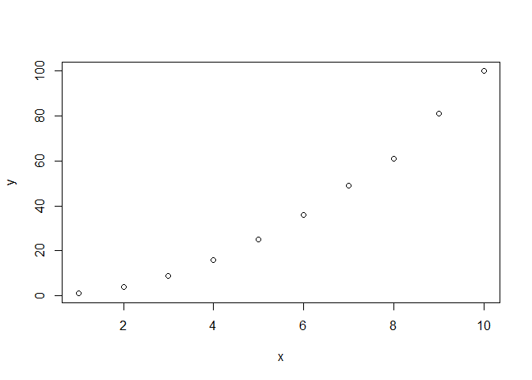

Prueba y borrar
================
Anderson  y Alely C.
12/11/2021

## Ejercicio 1

# a)

``` r
x <-(0.3*0.15)/((0.3*0.15)+(0.2*0.8)+(0.5*0.12))

x            #Al correr x sale el valor
```

    ## [1] 0.1698113

# b)

``` r
y <- 5^6/(factorial(6))*exp(-5)

y
```

    ## [1] 0.1462228

## Ejercicio 2

``` r
x<-c(1,2,3,4,5,6,7,8,9,10)
y<-c(1,4,9,16,25,36,49,61,81,100)

plot(x,y)
```

<!-- -->
