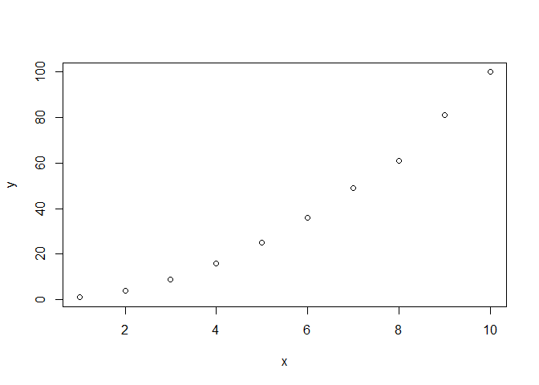
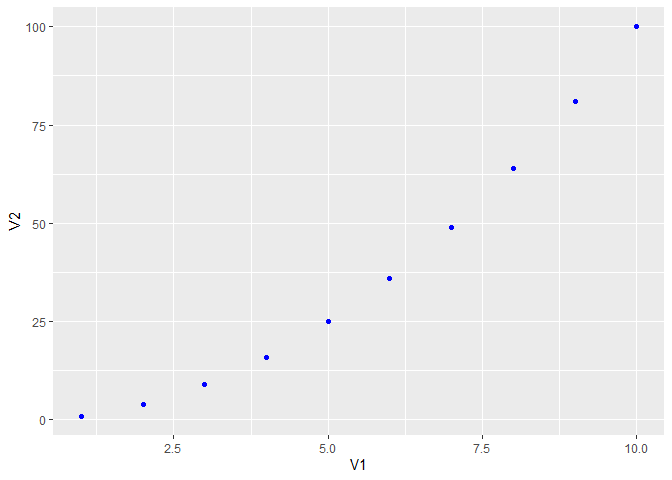
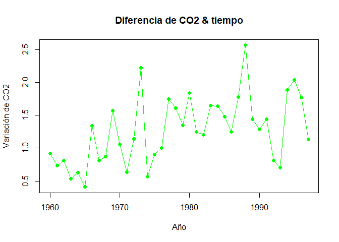

Ejercicios de R base
================
Anderson Vilca Tapia y Alely Crespo Ccerhuayo
18/11/2021

# PARTE 1

## Ejercicio 1

### Calcula los valores numéricos aproximados de:

### a)

``` r
x <-(0.3*0.15)/((0.3*0.15)+(0.2*0.8)+(0.5*0.12))

x            # Al correr x sale el valor
```

    ## [1] 0.1698113

### b)

``` r
y <- 5^6/(factorial(6))*exp(-5)

y             # Se comprueba
```

    ## [1] 0.1462228

### c)

``` r
# En este problema se puede observar que hay una conbinacion, por lo cual procedemos a resolver asi...

(choose(20,7))*((0.4)^7)*((0.6)^13)
```

    ## [1] 0.1658823

## Ejercicio 2

### Realizar la siguiente suma

### a)

``` r
sum(1:1000)
```

    ## [1] 500500

### b)

``` r
sum(2^(0:10))
```

    ## [1] 2047

## Ejercicio 3

### El vector grupo representa el grupo al que pertenece una serie de alumnos

### a)¿Cuántos elementos tiene?

``` r
load(url("https://goo.gl/uDzU8v"))

grupo
```

    ##   [1] "B" "A" "E" "D" "B" "D" "D" "A" "D" "C" "D" "E" "B" "E" "E" "E" "A" "B"
    ##  [19] "C" "C" "A" "C" "C" "D" "D" "E" "E" "A" "B" "C" "C" "E" "D" "C" "E" "E"
    ##  [37] "E" "E" "D" "D" "D" "E" "E" "E" "D" "E" "B" "E" "D" "C" "E" "D" "E" "E"
    ##  [55] "C" "B" "D" "C" "E" "D" "E" "B" "D" "B" "B" "C" "D" "C" "C" "C" "E" "D"
    ##  [73] "E" "D" "C" "D" "E" "E" "C" "D" "C" "E" "D" "A" "B" "B" "E" "E" "C" "D"
    ##  [91] "C" "E" "E" "C" "E" "D" "D" "D" "E" "D" "A" "D" "B" "B" "C" "D" "E" "A"
    ## [109] "E" "E" "A" "C" "E" "D" "A" "D" "D" "C" "E" "E" "E" "D" "A" "E" "E" "E"
    ## [127] "C" "C" "B" "C" "C" "D" "C" "B" "C" "A" "D" "E" "D" "E" "E" "B" "E" "E"
    ## [145] "E" "E" "C" "B" "D" "D" "E" "E" "D" "D" "E" "D" "E" "D" "D" "C" "D" "D"
    ## [163] "D" "C" "E" "D" "E" "C" "E" "B" "C" "C" "C" "D" "D" "B" "D" "B" "E" "C"
    ## [181] "E" "D" "D" "E" "D" "B" "B" "E" "E" "A" "C" "A"

``` r
length(grupo)       #Cantidad
```

    ## [1] 192

### b)¿En qué posiciones del vector está la letra “A?”

``` r
which(grupo == "A")
```

    ##  [1]   2   8  17  21  28  84 101 108 111 115 123 136 190 192

## Ejercicio 4

### El vector nota representa la nota de un examen de los alumnos que están en los grupos del vector grupo.

``` r
nota
```

    ##   [1] 4.9 5.4 5.2 6.8 5.0 6.2 4.4 4.1 4.3 5.5 5.5 4.8 6.4 6.8 5.5 4.7 5.2 6.4
    ##  [19] 4.8 3.4 4.7 6.0 5.9 5.4 5.3 5.6 6.9 5.6 4.2 4.4 5.8 4.8 6.1 6.2 6.6 5.2
    ##  [37] 4.6 5.0 2.5 4.0 5.6 4.9 5.4 3.9 4.2 4.7 4.2 5.4 3.7 6.2 5.9 3.7 5.8 2.7
    ##  [55] 5.6 5.0 2.6 5.0 4.9 3.4 5.9 4.3 6.1 4.5 5.5 3.2 3.2 6.4 4.4 6.0 5.0 5.4
    ##  [73] 7.0 3.8 4.2 4.7 4.7 5.3 6.8 4.0 7.2 4.8 6.0 4.1 4.5 5.8 2.9 5.0 4.6 4.9
    ##  [91] 6.8 4.2 6.9 5.7 5.7 6.4 4.4 4.2 4.5 5.8 4.3 3.7 7.4 3.9 5.2 4.9 3.6 5.5
    ## [109] 6.0 5.0 4.1 4.5 3.1 5.4 4.5 5.3 4.7 6.1 5.2 7.7 5.3 5.0 4.0 5.2 4.0 5.5
    ## [127] 4.0 5.4 4.6 3.4 6.2 5.7 3.8 4.8 4.0 4.4 5.5 5.9 5.9 5.7 4.9 1.7 5.5 5.9
    ## [145] 5.5 3.8 5.5 6.0 3.5 5.5 7.5 3.4 5.8 4.7 3.6 4.1 5.0 4.6 3.6 4.7 4.1 5.7
    ## [163] 5.9 4.7 3.2 5.5 3.0 4.5 5.5 5.9 5.6 6.0 4.4 3.7 4.4 6.8 6.1 4.7 4.2 6.2
    ## [181] 5.2 5.1 2.9 6.5 4.2 5.4 5.9 6.2 6.3 4.8 5.6 2.9

### a)¿Cuanto suman todas las notas?

``` r
sum(nota)
```

    ## [1] 962

### b)¿Cual es la media aritmética de todas las notas?

``` r
mean(nota)
```

    ## [1] 5.010417

### c)¿En qué posiciones están las notas mayores de 7.0?

``` r
which(nota> 7.0)
```

    ## [1]  81 103 120 151

### d)Visualiza las notas ordenadas de mayor a menor

``` r
sort(nota, decreasing = T)
```

    ##   [1] 7.7 7.5 7.4 7.2 7.0 6.9 6.9 6.8 6.8 6.8 6.8 6.8 6.6 6.5 6.4 6.4 6.4 6.4
    ##  [19] 6.3 6.2 6.2 6.2 6.2 6.2 6.2 6.1 6.1 6.1 6.1 6.0 6.0 6.0 6.0 6.0 6.0 5.9
    ##  [37] 5.9 5.9 5.9 5.9 5.9 5.9 5.9 5.9 5.8 5.8 5.8 5.8 5.8 5.7 5.7 5.7 5.7 5.7
    ##  [55] 5.6 5.6 5.6 5.6 5.6 5.6 5.5 5.5 5.5 5.5 5.5 5.5 5.5 5.5 5.5 5.5 5.5 5.5
    ##  [73] 5.5 5.4 5.4 5.4 5.4 5.4 5.4 5.4 5.4 5.3 5.3 5.3 5.3 5.2 5.2 5.2 5.2 5.2
    ##  [91] 5.2 5.2 5.1 5.0 5.0 5.0 5.0 5.0 5.0 5.0 5.0 5.0 4.9 4.9 4.9 4.9 4.9 4.9
    ## [109] 4.8 4.8 4.8 4.8 4.8 4.8 4.7 4.7 4.7 4.7 4.7 4.7 4.7 4.7 4.7 4.7 4.6 4.6
    ## [127] 4.6 4.6 4.5 4.5 4.5 4.5 4.5 4.5 4.4 4.4 4.4 4.4 4.4 4.4 4.4 4.3 4.3 4.3
    ## [145] 4.2 4.2 4.2 4.2 4.2 4.2 4.2 4.2 4.1 4.1 4.1 4.1 4.1 4.0 4.0 4.0 4.0 4.0
    ## [163] 4.0 3.9 3.9 3.8 3.8 3.8 3.7 3.7 3.7 3.7 3.6 3.6 3.6 3.5 3.4 3.4 3.4 3.4
    ## [181] 3.2 3.2 3.2 3.1 3.0 2.9 2.9 2.9 2.7 2.6 2.5 1.7

### e)¿En qué posición está la nota máxima?

``` r
which(nota == max(nota))
```

    ## [1] 120

## Ejercicio 5

### A partir de los vectores grupo y nota definidos.

### a)Suma las notas de los 10 primeros alumnos del vector

``` r
sum(nota[1:10])
```

    ## [1] 51.8

### b)¿Cuántos alumnos hay del grupo C?

``` r
length(grupo[grupo == "C"])
```

    ## [1] 39

### c)¿Cuántos alumnos han aprobado?

``` r
length(nota[nota>=5])
```

    ## [1] 102

### d)¿Cuántos alumnos del grupo B han aprobado?

``` r
length(nota[grupo == "B" & nota >= 5])
```

    ## [1] 12

### e)¿Qué porcentaje de alumnos del grupo C han aprobado?

``` r
(length(nota[grupo == "C" & nota >= 5])/length(nota[grupo == "C"]))*100
```

    ## [1] 58.97436

### f)¿De qué grupos son la máxima y mínima notas de toda la muestra?

``` r
grupo[nota == max(nota)]
```

    ## [1] "E"

``` r
grupo[nota == min(nota)]
```

    ## [1] "B"

### g)Nota media de los alumnos de grupo A y B, juntos, considerando sólo a los que han aprobado.

``` r
library(dplyr)
```

    ## 
    ## Attaching package: 'dplyr'

    ## The following objects are masked from 'package:stats':
    ## 
    ##     filter, lag

    ## The following objects are masked from 'package:base':
    ## 
    ##     intersect, setdiff, setequal, union

``` r
notasEst <- dplyr::tibble(grupoAyB = grupo, notaAyB = nota)
notasEst %>%
  dplyr::filter((grupoAyB == "A" & notaAyB >=5) | (grupoAyB == "B" & notaAyB >= 5)) %>%
  dplyr::summarise(mean(notaAyB))
```

    ## # A tibble: 1 x 1
    ##   `mean(notaAyB)`
    ##             <dbl>
    ## 1            5.82

## Ejercicio 6

``` r
# Cuantil 66 de todos
quantile(nota, probs = 0.66)
```

    ## 66% 
    ## 5.5

``` r
# Cuantil 66 del grupo "C" 
quantile(nota[grupo == "C"], probs = 0.66)
```

    ##   66% 
    ## 5.808

## Ejercicio 7

``` r
# Porcentaje del total de alumnos que tienen una nota menor o igual que 4.9 
((length(nota[nota <= 4.9 ]))/(length(nota)))*100
```

    ## [1] 46.875

``` r
# Porcentaje mayor o igual que 4.9
((length(nota[nota >= 4.9]))/(length(nota)))*100
```

    ## [1] 56.25

## Ejercicio 8

``` r
library(ggplot2)
```

    ## Warning in (function (kind = NULL, normal.kind = NULL, sample.kind = NULL) :
    ## non-uniform 'Rounding' sampler used

``` r
notasEst <- dplyr::tibble(grupo, nota)
notasEst %>% ggplot(mapping = aes(x = grupo, y = nota)) +
  geom_boxplot()
```

<!-- -->

## Ejercicio 9

``` r
conc
```

    ##   [1]  4.76  4.60  6.14  2.96  3.15  1.77  4.36  4.00  2.03  6.13  2.88  6.15
    ##  [13]  3.05  3.37  5.21  3.10  3.57  7.11  7.32  2.75  6.96  7.66  3.54  6.48
    ##  [25]  6.19  7.77  8.96  6.94  5.70  7.14  8.38  5.69  7.24 10.57  9.99  9.83
    ##  [37]  9.06 11.28  7.07 11.09 11.20 10.73 12.24 13.14 14.69 12.48 12.91 12.48
    ##  [49] 14.10 13.87 14.98 15.46 17.67 14.78 17.51 14.10 16.60 19.75 14.86 20.63
    ##  [61] 18.37 19.81 19.40 19.48 19.36 21.91 22.70 24.81 23.74 21.98 22.40 24.28
    ##  [73] 25.27 25.67 23.74 24.33 24.51 26.65 25.65 27.74 29.32 29.05 31.06 28.73
    ##  [85] 30.97 31.36 28.61 30.50 31.72 30.93 32.61 32.76 31.24 34.54 32.11 34.23
    ##  [97] 35.08 36.34 32.54 35.51 36.19 35.97 37.79 36.69 38.18 36.11 38.08 39.05
    ## [109] 38.11 37.86 40.08 39.36 42.05 39.43 37.80 39.10 40.99 41.34 38.66 41.48
    ## [121] 43.77 42.70 42.42 42.30 43.72 40.57 40.49 41.81 43.84 45.71 42.26 45.00
    ## [133] 42.76 45.97 44.04 43.17 42.56 43.11 42.46 42.29 44.80 47.34 45.32 44.49
    ## [145] 45.57 46.70 43.86 45.39 43.38 43.02 43.66 44.64 45.57 43.71 42.77 43.88
    ## [157] 43.18 41.67 45.37 40.52 42.98 44.91 41.52 40.12 41.97 42.36 42.52 40.95
    ## [169] 39.12 42.23 41.90 41.73 42.19 41.10 40.45 38.89 37.95 42.06 37.97 40.29
    ## [181] 36.50 38.18 37.34 38.67 39.15 39.54 38.12 37.59 33.63 36.01 33.46 32.70
    ## [193] 35.48 35.19 34.83 32.79 30.55 34.24 31.56 27.99 30.63 32.71 28.28 30.03
    ## [205] 32.46 27.45 28.88 25.21 27.86 25.62 24.71 25.06 27.52 24.32 25.57 24.59
    ## [217] 25.97 22.82 24.84 20.93 23.93 22.78 20.20 22.85 21.81 17.71 18.03 18.05
    ## [229] 18.95 17.31 15.58 16.22 15.83 18.48 16.81 19.00 17.37 20.37 16.53 14.03
    ## [241] 15.51 11.71 11.72 10.65 15.09 12.64 12.56 11.65  8.68 10.61 10.54  6.88
    ## [253]  8.85  6.92 11.67 10.31  9.51  8.27  9.42  9.28  8.67  6.48  6.14  5.48
    ## [265]  4.14  5.50  9.17  3.86  3.80  5.66  2.73  7.80  3.75  5.96  3.75  6.88
    ## [277]  5.79  2.91  2.88  2.58  3.11  0.93  1.07  3.46  3.87  5.48  3.67  3.55

### a)¿Cuál ha sido la concentración máxima?

``` r
max(conc)
```

    ## [1] 47.34

### b)¿En cuántos de los muestreos se ha superado la concentración de 40.0 ppm?

``` r
length(conc[conc > 40.0])
```

    ## [1] 61

### c)¿Cuál ha sido la concentración media del día?

``` r
mean(conc)
```

    ## [1] 24.07229

### d)¿Cuáles fueron las 10 mediciones más bajas del día?

``` r
sort(conc)[1:10]
```

    ##  [1] 0.93 1.07 1.77 2.03 2.58 2.73 2.75 2.88 2.88 2.91

### e)Si la primera medida fue a las 00:00. ¿A qué hora del día se alcanzó la concentración máxima?

``` r
fecha <- seq(
  as.POSIXct("2021-01-01 00:00"),
  length.out = length(conc),
  by = "5 min"
)

#concentracion de plomo y las fechas
concYfech <- data.frame(conc, fecha)
#maximo de concentracion con fecha
concYfech[conc == max(conc),]
```

    ##      conc               fecha
    ## 142 47.34 2021-01-01 11:45:00

# PARTE 2

## Ejercicio 1

### Graficar los puntos (1,1),(2,4),(3,6),(4,8),(5,2),(6,36),(7,49),(8,61),(9,81),(10,100) en un plano utilizando RStudio.

``` r
x<-c(1,2,3,4,5,6,7,8,9,10)
y<-c(1,4,9,16,25,36,49,61,81,100)

plot(x,y)
```

<!-- -->

``` r
#otra forma

z<-matrix(c(1:10,(1:10)^2), nrow = 10)
DF2 = as.data.frame((z), row.names= c("eje_x", "eje_y"))
View(DF2)
ggplot(data = DF2) +
  geom_point(mapping = aes(x =V1 , y =V2), color = "blue")
```

<!-- -->

## Ejercicio 2

### Ingresar la matriz

``` r
matrix(c(1,2,3,2,4,6,3,6,9,4,8,12), nrow = 4, byrow = T)
```

    ##      [,1] [,2] [,3]
    ## [1,]    1    2    3
    ## [2,]    2    4    6
    ## [3,]    3    6    9
    ## [4,]    4    8   12

``` r
# Otra forma
l<-c(1,2,3,4,2,4,6,8,3,6,9,12)
A<-matrix(l,ncol = 3,nrow = 4)

A    # Matriz A
```

    ##      [,1] [,2] [,3]
    ## [1,]    1    2    3
    ## [2,]    2    4    6
    ## [3,]    3    6    9
    ## [4,]    4    8   12

## Ejercicio 3

### Ingresar la matriz

``` r
3*diag(3)
```

    ##      [,1] [,2] [,3]
    ## [1,]    3    0    0
    ## [2,]    0    3    0
    ## [3,]    0    0    3

## Ejercicio 4

### Crea una función que cree una matriz nula ingresando las dimensiones

``` r
matrizY<-function(f,c){
  P<-matrix(0,nrow = f,ncol = c)
  return(P)
}
matrizY(5,4)
```

    ##      [,1] [,2] [,3] [,4]
    ## [1,]    0    0    0    0
    ## [2,]    0    0    0    0
    ## [3,]    0    0    0    0
    ## [4,]    0    0    0    0
    ## [5,]    0    0    0    0

## Ejercicio 5

``` r
B<-diag(4)
B[1,1]<-0
B[2,2]<-2
B[3,3]<-3
B[4,4]<-4

B  # Matriz B
```

    ##      [,1] [,2] [,3] [,4]
    ## [1,]    0    0    0    0
    ## [2,]    0    2    0    0
    ## [3,]    0    0    3    0
    ## [4,]    0    0    0    4

``` r
# Otra forma

diag(x = c(0,2,3,4),nrow = 4)
```

    ##      [,1] [,2] [,3] [,4]
    ## [1,]    0    0    0    0
    ## [2,]    0    2    0    0
    ## [3,]    0    0    3    0
    ## [4,]    0    0    0    4

## Ejercicio 6

``` r
t(A)
```

    ##      [,1] [,2] [,3] [,4]
    ## [1,]    1    2    3    4
    ## [2,]    2    4    6    8
    ## [3,]    3    6    9   12

## Ejercicio 7

### Realizar las siguientes operaciones A+B , A−B , 3B y AB

``` r
#Las dimensiones son incompatibles.

"A+B" 
```

    ## [1] "A+B"

``` r
#Las dimensiones son incompatibles.

"A-B" 
```

    ## [1] "A-B"

``` r
# La matriz de la pregunta 5 por tres

3*B
```

    ##      [,1] [,2] [,3] [,4]
    ## [1,]    0    0    0    0
    ## [2,]    0    6    0    0
    ## [3,]    0    0    9    0
    ## [4,]    0    0    0   12

``` r
#Filas y columnas diferentes

"A%*%B" 
```

    ## [1] "A%*%B"

## Ejercicio 8

### Crea una función para calcular P^6

``` r
m<-function(e){
  d<-c(1,-2,1,2,4,0,3,-2,1)
  m<-matrix(d,ncol = 3)
  r<-m^e
  return(r)
}
m(6)
```

    ##      [,1] [,2] [,3]
    ## [1,]    1   64  729
    ## [2,]   64 4096   64
    ## [3,]    1    0    1

## Ejercicio 9

### Resolver el sistema de ecuaciones

``` r
ecuaciones <- rbind(c(3, -1, 1), 
                    c(9, -2, 1), 
                    c(3, 1, -2))
equivalencias <- c(-1, -9, -9)
solve(ecuaciones, equivalencias)
```

    ## [1] -1  2  4

## Ejercicio 10

### Utilizando la ayuda de R, investigue para qué sirven las funciones

``` r
?eigen()
```

    ## starting httpd help server ... done

``` r
?det()
```

## Ejercicio 11

### Considerando las matrices

``` r
B <- matrix(c(1:10, seq(2, 20, by = 2), seq(3, 30, by = 3), seq(4, 40, by = 4), 
              seq(5, 50, by = 5)), nrow = 10)
              
A <- matrix(c(rep(c(0,1),7), rep(c(0,0,1),2),1,0,1,1,0), nrow = 5, byrow = T)
```

### Calcular A⋅B−AB^t

``` r
#(B %*% A)-(A)%*%t(B)     no se resuelve por diferentes dimesiones
```

## Ejercicio 12

### Considere

``` r
x2 <- matrix(c(rep(1,5), 1, -1, 0:2), nrow = 5, byrow = F)
y2 <- matrix(c(0,0,1,1,3), nrow = 5, byrow = F)

solve(t(x2)%*%x2)%*%t(x2)%*%y2
```

    ##           [,1]
    ## [1,] 0.5384615
    ## [2,] 0.7692308

## Ejercicio 13

### Corre el siguiente código para cargar los vectores year y co2 en memoria

``` r
data(co2)
means = aggregate(co2, FUN=mean)
year = as.vector(time(means))
co2 = as.vector(means)


df_co2 <- data.frame(year = year, co2 = co2) %>%
  mutate(co2_2 = lag(co2), dif_co2 = co2 - co2_2)
vect_diferencia <- df_co2$dif_co2[2:39]
vect_diferencia
```

    ##  [1] 0.9216667 0.7375000 0.8125000 0.5350000 0.6300000 0.4100000 1.3375000
    ##  [8] 0.8100000 0.8700000 1.5691667 1.0583333 0.6375000 1.1383333 2.2183333
    ## [15] 0.5675000 0.9066667 1.0000000 1.7441667 1.6058333 1.3450000 1.8341667
    ## [22] 1.2458333 1.1983333 1.6491667 1.6383333 1.4791667 1.2491667 1.7758333
    ## [29] 2.5625000 1.4408333 1.2825000 1.4416667 0.8133333 0.7041667 1.8841667
    ## [36] 2.0341667 1.7725000 1.1308333

``` r
plot(x = df_co2$year[2:39], y = vect_diferencia, xlab = "Año", ylab = "Variación de CO2",
     main = "Diferencia de CO2 & tiempo", type = "o", pch = 16, col="green")
```

<!-- -->

``` r
plot(x = df_co2$year[2:39], y = vect_diferencia, xlab = "Años", ylab = "Variación de CO2",
     main = "Diferencia de CO2 & tiempo", type = "o", pch = 16, xlim = c(1960,2020),
     ylim = c(0,3))
points(2020, 2.64, pch = 4, col = "red")
```

<!-- -->

## Ejercicio 14

``` r
# a)

rainfalldf <- read.csv("C:/Users/PC/Downloads/rainfall.csv")

# b)

rainfalldf[(rainfalldf$sep > 180),]
```

    ##  [1] num      altitude sep      oct      nov      dec      jan      feb     
    ##  [9] mar      apr      may      name     x_utm    y_utm   
    ## <0 rows> (or 0-length row.names)

``` r
rain180 <- rainfalldf[(rainfalldf$sep > 180) | (rainfalldf$oct > 180) | (rainfalldf$nov > 180) | (rainfalldf$dec > 180) | (rainfalldf$jan > 180) | (rainfalldf$feb > 180) | (rainfalldf$mar > 180) | (rainfalldf$apr > 180) | (rainfalldf$may > 180),]
rain180$name
```

    ## [1] "Golan Farm" "Eilon"      "Fasutta"    "Yehiam"     "Kfar Mahol"
    ## [6] "Meron"      "Horashim"
