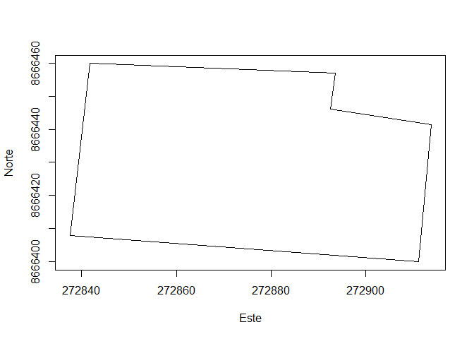

Exámen Parcial
================
Anderson Vilca
10/12/2021

# PARTE 1

## Ejercicio 1

### Crear una funcion que permita calcular el ́angulo entre las rectas L1 y L2 teniendo sus pendientes como parametros. La funcion debe considerar si estas rectas no se cruzan.

``` r
 Angulo_alfa <- function(m1 = "Pendiente de L1", m2 = "Pendiente de L2"){
    formula_ecuacion <- atan((m2 - m1)/(1 + m1*m2))
    return(formula_ecuacion)
  }
  
  Angulo_alfa(1,0.5)
```

    ## [1] -0.3217506

## Ejercicio 2

### Crear una funcion que grafique un poligono ingresando un dataframe con sus coordenadas este y norte como parametros. La funcion debe aceptar dataframes con un maximo de 50 registros, realizar la prueba con las siguientes coordenadas.

``` r
 Codigos<-c("A","B","C","D","E","F")

  Este<-c(272841.7,272893.6,272892.5,272913.8,272911.2,272837.5)
  
  Norte<-c(8666459.9,8666456.9,8666446.1,8666441.5,8666399.9,8666407.9)
  
  Dataf<-data.frame(Codigos,Este,Norte)
  
  poligono<-function(df){
    Este<-c(df[,"Este"],df[1,2])
    Norte<-c(df[,"Norte"],df[1,3])
    return(plot(Este,Norte,type="l"))
  }
  poligono(Dataf)
```

<!-- -->

# PARTE 2

## Ejercicio 1

### El dataset kc house data tiene informacion de ventas de viviendas entre mayo del 2014 y 2015 en el condado de King, estado de Washington, EEUU. Esta base es empleada es bastante utilizada para ejercicios de regresion. La columna price tiene los precios de las viviendas y las demas son caracteristicas de las casas en venta.

``` r
Data_2 <- read.csv("C:/Users/PC/Downloads/kc_house_data.csv")
```

## Ejercicio 2

## Ejercicio 3

### Leer el dataset de frutas dataset-fruits.csv realizar lo siguiente.

``` r
Data <- read.csv("C:/Users/PC/Downloads/dataset-fruits.csv")

Data
```

    ##     ï.._id paisorigen_id   pais_origen producto paisdestino_id pais_destino
    ## 1        1           210       Ecuador   Banana             32    Argentina
    ## 2        2           202       Bolivia   Banana             32    Argentina
    ## 3        3           221      Paraguay   Banana             32    Argentina
    ## 4        4           203        Brasil   Banana             32    Argentina
    ## 5        5            NA         Otros   Banana             32    Argentina
    ## 6        6           210       Ecuador   Banana             32    Argentina
    ## 7        7           202       Bolivia   Banana             32    Argentina
    ## 8        8           221      Paraguay   Banana             32    Argentina
    ## 9        9           203        Brasil   Banana             32    Argentina
    ## 10      10            NA         Otros   Banana             32    Argentina
    ## 11      11           210       Ecuador   Banana             32    Argentina
    ## 12      12           202       Bolivia   Banana             32    Argentina
    ## 13      13           221      Paraguay   Banana             32    Argentina
    ## 14      14           203        Brasil   Banana             32    Argentina
    ## 15      15            NA         Otros   Banana             32    Argentina
    ## 16      16           210       Ecuador   Banana             32    Argentina
    ## 17      17           202       Bolivia   Banana             32    Argentina
    ## 18      18           221      Paraguay   Banana             32    Argentina
    ## 19      19           203        Brasil   Banana             32    Argentina
    ## 20      20            NA         Otros   Banana             32    Argentina
    ## 21      21           210       Ecuador   Banana             32    Argentina
    ## 22      22           202       Bolivia   Banana             32    Argentina
    ## 23      23           221      Paraguay   Banana             32    Argentina
    ## 24      24           203        Brasil   Banana             32    Argentina
    ## 25      25            NA         Otros   Banana             32    Argentina
    ## 26      26           210       Ecuador   Ananá             32    Argentina
    ## 27      27           203        Brasil   Ananá             32    Argentina
    ## 28      28           221      Paraguay   Ananá             32    Argentina
    ## 29      29           202       Bolivia   Ananá             32    Argentina
    ## 30      30           206    Costa Rica   Ananá             32    Argentina
    ## 31      31            NA         Otros   Ananá             32    Argentina
    ## 32      32           210       Ecuador   Ananá             32    Argentina
    ## 33      33           203        Brasil   Ananá             32    Argentina
    ## 34      34           221      Paraguay   Ananá             32    Argentina
    ## 35      35           202       Bolivia   Ananá             32    Argentina
    ## 36      36           206    Costa Rica   Ananá             32    Argentina
    ## 37      37            NA         Otros   Ananá             32    Argentina
    ## 38      38           210       Ecuador   Ananá             32    Argentina
    ## 39      39           203        Brasil   Ananá             32    Argentina
    ## 40      40           221      Paraguay   Ananá             32    Argentina
    ## 41      41           202       Bolivia   Ananá             32    Argentina
    ## 42      42           206    Costa Rica   Ananá             32    Argentina
    ## 43      43            NA         Otros   Ananá             32    Argentina
    ## 44      44           210       Ecuador   Ananá             32    Argentina
    ## 45      45           203        Brasil   Ananá             32    Argentina
    ## 46      46           221      Paraguay   Ananá             32    Argentina
    ## 47      47           202       Bolivia   Ananá             32    Argentina
    ## 48      48           206    Costa Rica   Ananá             32    Argentina
    ## 49      49            NA         Otros   Ananá             32    Argentina
    ## 50      50           210       Ecuador   Ananá             32    Argentina
    ## 51      51           203        Brasil   Ananá             32    Argentina
    ## 52      52           221      Paraguay   Ananá             32    Argentina
    ## 53      53           202       Bolivia   Ananá             32    Argentina
    ## 54      54           206    Costa Rica   Ananá             32    Argentina
    ## 55      55            NA         Otros   Ananá             32    Argentina
    ## 56      56           203        Brasil    Mango             32    Argentina
    ## 57      57           210       Ecuador    Mango             32    Argentina
    ## 58      58            NA         Otros    Mango             32    Argentina
    ## 59      59           203        Brasil    Mango             32    Argentina
    ## 60      60           210       Ecuador    Mango             32    Argentina
    ## 61      61            NA         Otros    Mango             32    Argentina
    ## 62      62           203        Brasil    Mango             32    Argentina
    ## 63      63           210       Ecuador    Mango             32    Argentina
    ## 64      64            NA         Otros    Mango             32    Argentina
    ## 65      65           203        Brasil    Mango             32    Argentina
    ## 66      66           210       Ecuador    Mango             32    Argentina
    ## 67      67            NA         Otros    Mango             32    Argentina
    ## 68      68           203        Brasil    Mango             32    Argentina
    ## 69      69           210       Ecuador    Mango             32    Argentina
    ## 70      70            NA         Otros    Mango             32    Argentina
    ## 71      71           208         Chile     Kiwi             32    Argentina
    ## 72      72           417        Italia     Kiwi             32    Argentina
    ## 73      73           504 Nueva Zelanda     Kiwi             32    Argentina
    ## 74      74            NA         Otros     Kiwi             32    Argentina
    ## 75      75           208         Chile     Kiwi             32    Argentina
    ## 76      76           417        Italia     Kiwi             32    Argentina
    ## 77      77           504 Nueva Zelanda     Kiwi             32    Argentina
    ## 78      78            NA         Otros     Kiwi             32    Argentina
    ## 79      79           208         Chile     Kiwi             32    Argentina
    ## 80      80           417        Italia     Kiwi             32    Argentina
    ## 81      81           504 Nueva Zelanda     Kiwi             32    Argentina
    ## 82      82            NA         Otros     Kiwi             32    Argentina
    ## 83      83           208         Chile     Kiwi             32    Argentina
    ## 84      84           417        Italia     Kiwi             32    Argentina
    ## 85      85           504 Nueva Zelanda     Kiwi             32    Argentina
    ## 86      86            NA         Otros     Kiwi             32    Argentina
    ## 87      87           208         Chile     Kiwi             32    Argentina
    ## 88      88           417        Italia     Kiwi             32    Argentina
    ## 89      89           504 Nueva Zelanda     Kiwi             32    Argentina
    ## 90      90            NA         Otros     Kiwi             32    Argentina
    ## 91      91           208         Chile    Palta             32    Argentina
    ## 92      92           218       México    Palta             32    Argentina
    ## 93      93           222         Perú    Palta             32    Argentina
    ## 94      94            NA         Otros    Palta             32    Argentina
    ## 95      95           208         Chile    Palta             32    Argentina
    ## 96      96           218       México    Palta             32    Argentina
    ## 97      97           222         Perú    Palta             32    Argentina
    ## 98      98            NA         Otros    Palta             32    Argentina
    ## 99      99           208         Chile    Palta             32    Argentina
    ## 100    100           218       México    Palta             32    Argentina
    ## 101    101           222         Perú    Palta             32    Argentina
    ## 102    102            NA         Otros    Palta             32    Argentina
    ## 103    103           208         Chile    Palta             32    Argentina
    ## 104    104           218       México    Palta             32    Argentina
    ## 105    105           222         Perú    Palta             32    Argentina
    ## 106    106            NA         Otros    Palta             32    Argentina
    ## 107    107           208         Chile    Palta             32    Argentina
    ## 108    108           218       México    Palta             32    Argentina
    ## 109    109           222         Perú    Palta             32    Argentina
    ## 110    110            NA         Otros    Palta             32    Argentina
    ##     aÃ.o moneda_cod  moneda   totales
    ## 1   2013        USD Dolares 151963.47
    ## 2   2013        USD Dolares  30271.17
    ## 3   2013        USD Dolares   4802.20
    ## 4   2013        USD Dolares   4765.58
    ## 5   2013        USD Dolares      0.00
    ## 6   2014        USD Dolares 162352.90
    ## 7   2014        USD Dolares  37248.63
    ## 8   2014        USD Dolares   6372.06
    ## 9   2014        USD Dolares   7660.75
    ## 10  2014        USD Dolares      0.00
    ## 11  2015        USD Dolares 156409.67
    ## 12  2015        USD Dolares  41815.06
    ## 13  2015        USD Dolares   8847.91
    ## 14  2015        USD Dolares   7907.47
    ## 15  2015        USD Dolares      0.00
    ## 16  2016        USD Dolares 156873.56
    ## 17  2016        USD Dolares  38354.46
    ## 18  2016        USD Dolares   9137.90
    ## 19  2016        USD Dolares   4797.27
    ## 20  2016        USD Dolares     14.56
    ## 21  2017        USD Dolares 188401.45
    ## 22  2017        USD Dolares  37432.23
    ## 23  2017        USD Dolares   8876.43
    ## 24  2017        USD Dolares   4177.66
    ## 25  2017        USD Dolares        NA
    ## 26  2013        USD Dolares   5825.50
    ## 27  2013        USD Dolares    602.36
    ## 28  2013        USD Dolares    774.47
    ## 29  2013        USD Dolares    437.76
    ## 30  2013        USD Dolares     88.13
    ## 31  2013        USD Dolares   5825.50
    ## 32  2014        USD Dolares   6101.07
    ## 33  2014        USD Dolares    942.50
    ## 34  2014        USD Dolares   1042.22
    ## 35  2014        USD Dolares    482.37
    ## 36  2014        USD Dolares      0.00
    ## 37  2014        USD Dolares   6101.07
    ## 38  2015        USD Dolares   5952.36
    ## 39  2015        USD Dolares    885.80
    ## 40  2015        USD Dolares    803.41
    ## 41  2015        USD Dolares    623.25
    ## 42  2015        USD Dolares      0.00
    ## 43  2015        USD Dolares   5952.36
    ## 44  2016        USD Dolares   6361.72
    ## 45  2016        USD Dolares   1269.51
    ## 46  2016        USD Dolares   1142.32
    ## 47  2016        USD Dolares    360.18
    ## 48  2016        USD Dolares      0.00
    ## 49  2016        USD Dolares   6361.72
    ## 50  2017        USD Dolares   8085.51
    ## 51  2017        USD Dolares   1778.53
    ## 52  2017        USD Dolares    898.80
    ## 53  2017        USD Dolares    157.89
    ## 54  2017        USD Dolares    200.94
    ## 55  2017        USD Dolares   8085.51
    ## 56  2013        USD Dolares   2005.83
    ## 57  2013        USD Dolares    275.18
    ## 58  2013        USD Dolares      0.00
    ## 59  2014        USD Dolares   2152.45
    ## 60  2014        USD Dolares    144.23
    ## 61  2014        USD Dolares      0.00
    ## 62  2015        USD Dolares   2189.14
    ## 63  2015        USD Dolares     85.50
    ## 64  2015        USD Dolares      0.00
    ## 65  2016        USD Dolares   2219.05
    ## 66  2016        USD Dolares     55.84
    ## 67  2016        USD Dolares      0.00
    ## 68  2017        USD Dolares   2749.70
    ## 69  2017        USD Dolares     28.79
    ## 70  2017        USD Dolares      0.00
    ## 71  2013        USD Dolares  11316.54
    ## 72  2013        USD Dolares   4159.50
    ## 73  2013        USD Dolares        NA
    ## 74  2013        USD Dolares     58.67
    ## 75  2014        USD Dolares   4611.40
    ## 76  2014        USD Dolares   5022.60
    ## 77  2014        USD Dolares     47.58
    ## 78  2014        USD Dolares      0.00
    ## 79  2015        USD Dolares  11277.40
    ## 80  2015        USD Dolares   4482.19
    ## 81  2015        USD Dolares        NA
    ## 82  2015        USD Dolares      0.00
    ## 83  2016        USD Dolares   7916.80
    ## 84  2016        USD Dolares   6091.73
    ## 85  2016        USD Dolares    215.61
    ## 86  2016        USD Dolares      0.00
    ## 87  2017        USD Dolares   9520.45
    ## 88  2017        USD Dolares   7825.25
    ## 89  2017        USD Dolares    217.24
    ## 90  2017        USD Dolares        NA
    ## 91  2013        USD Dolares  17692.93
    ## 92  2013        USD Dolares      0.00
    ## 93  2013        USD Dolares      0.00
    ## 94  2013        USD Dolares      0.00
    ## 95  2014        USD Dolares  25466.34
    ## 96  2014        USD Dolares      0.00
    ## 97  2014        USD Dolares      0.00
    ## 98  2014        USD Dolares      0.00
    ## 99  2015        USD Dolares  25322.14
    ## 100 2015        USD Dolares      0.00
    ## 101 2015        USD Dolares      0.00
    ## 102 2015        USD Dolares      0.00
    ## 103 2016        USD Dolares  24510.68
    ## 104 2016        USD Dolares    760.45
    ## 105 2016        USD Dolares      0.00
    ## 106 2016        USD Dolares      0.00
    ## 107 2017        USD Dolares  40222.21
    ## 108 2017        USD Dolares   1386.43
    ## 109 2017        USD Dolares   1619.81
    ## 110 2017        USD Dolares      0.00

### a) Eliminar la columna id

``` r
Data$ï.._id = NULL 

head(Data)
```

    ##   paisorigen_id pais_origen producto paisdestino_id pais_destino aÃ.o
    ## 1           210     Ecuador   Banana             32    Argentina 2013
    ## 2           202     Bolivia   Banana             32    Argentina 2013
    ## 3           221    Paraguay   Banana             32    Argentina 2013
    ## 4           203      Brasil   Banana             32    Argentina 2013
    ## 5            NA       Otros   Banana             32    Argentina 2013
    ## 6           210     Ecuador   Banana             32    Argentina 2014
    ##   moneda_cod  moneda   totales
    ## 1        USD Dolares 151963.47
    ## 2        USD Dolares  30271.17
    ## 3        USD Dolares   4802.20
    ## 4        USD Dolares   4765.58
    ## 5        USD Dolares      0.00
    ## 6        USD Dolares 162352.90

### b) Mostrar un resumen del dataset y explicar a grandes rasgos

``` r
summary(Data)
```

    ##  paisorigen_id   pais_origen          producto         paisdestino_id
    ##  Min.   :202.0   Length:110         Length:110         Min.   :32    
    ##  1st Qu.:203.0   Class :character   Class :character   1st Qu.:32    
    ##  Median :210.0   Mode  :character   Mode  :character   Median :32    
    ##  Mean   :239.3                                         Mean   :32    
    ##  3rd Qu.:221.0                                         3rd Qu.:32    
    ##  Max.   :504.0                                         Max.   :32    
    ##  NA's   :25                                                          
    ##  pais_destino            aÃ.o       moneda_cod           moneda         
    ##  Length:110         Min.   :2013   Length:110         Length:110        
    ##  Class :character   1st Qu.:2014   Class :character   Class :character  
    ##  Mode  :character   Median :2015   Mode  :character   Mode  :character  
    ##                     Mean   :2015                                        
    ##                     3rd Qu.:2016                                        
    ##                     Max.   :2017                                        
    ##                                                                         
    ##     totales         
    ##  Min.   :     0.00  
    ##  1st Qu.:    18.12  
    ##  Median :  1327.97  
    ##  Mean   : 12898.82  
    ##  3rd Qu.:  7338.58  
    ##  Max.   :188401.45  
    ##  NA's   :4

### c) Determinar cuales son los productos m ́as importantes por cada paıss

### d) Realizar un grafico que represente la cantidad de dolares que transacciona cada paıs

## Ejercicio 4

``` r
vector<-sample(1:100,10)
tras<- function(vector){
  invert<-length(vector)
  for(j in 1:(invert-1)){
    for(i in 1:(invert-j)){
      if(vector[i]>vector[i+1]){
        itit<-vector[i]
        vector[i]<-vector[i+1]
        vector[i+1]<-itit
      }
    }
  }
  return(vector)
}
invertido<-tras(vector)

vector
```

    ##  [1] 45  2 69 43 95 62 23 96 94 48

``` r
invertido
```

    ##  [1]  2 23 43 45 48 62 69 94 95 96
