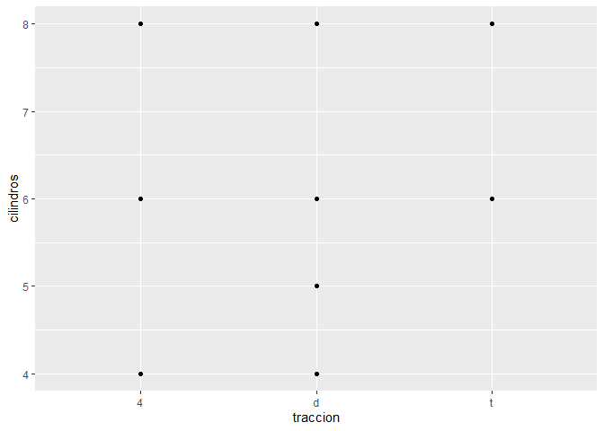
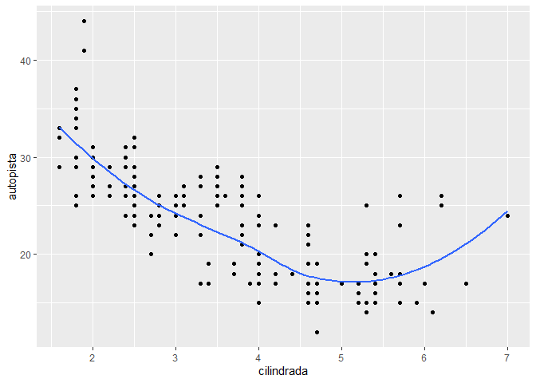
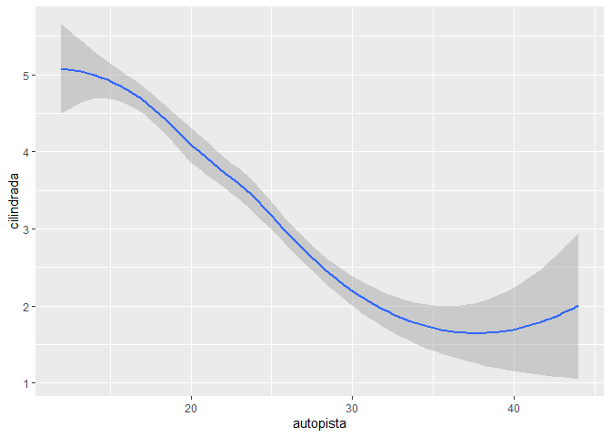
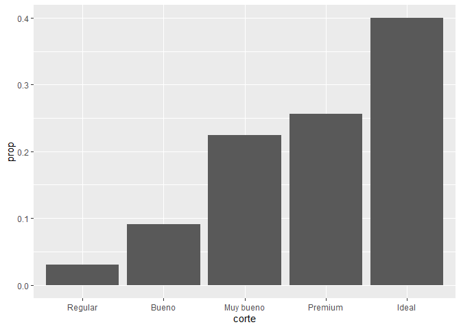
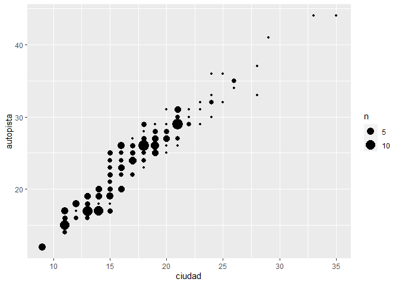

EJERCICIOS GGPLOT2
================
Alely Gabriela, Crespo Ccerhuayo & Anderson Thomas, Vilca Tapia
22/1/2022

# 10. Ejercicios: ggplot2

``` r
library(ggplot2)
```

    ## Warning: package 'ggplot2' was built under R version 4.1.2

``` r
library(datos)
```

    ## Warning: package 'datos' was built under R version 4.1.2

``` r
millas
```

    ## # A tibble: 234 x 11
    ##    fabricante modelo     cilindrada  anio cilindros transmision traccion ciudad
    ##    <chr>      <chr>           <dbl> <int>     <int> <chr>       <chr>     <int>
    ##  1 audi       a4                1.8  1999         4 auto(l5)    d            18
    ##  2 audi       a4                1.8  1999         4 manual(m5)  d            21
    ##  3 audi       a4                2    2008         4 manual(m6)  d            20
    ##  4 audi       a4                2    2008         4 auto(av)    d            21
    ##  5 audi       a4                2.8  1999         6 auto(l5)    d            16
    ##  6 audi       a4                2.8  1999         6 manual(m5)  d            18
    ##  7 audi       a4                3.1  2008         6 auto(av)    d            18
    ##  8 audi       a4 quattro        1.8  1999         4 manual(m5)  4            18
    ##  9 audi       a4 quattro        1.8  1999         4 auto(l5)    4            16
    ## 10 audi       a4 quattro        2    2008         4 manual(m6)  4            20
    ## # ... with 224 more rows, and 3 more variables: autopista <int>,
    ## #   combustible <chr>, clase <chr>

## Parte 1: Ggplot base

### 1. Ejecuta ggplot(data = millas). ¿Qué observas?

``` r
ggplot(data = millas)
```

<!-- -->

``` r
# Nos resulta un gráfico en blanco. 
```

### 2. ¿Cuántas filas hay en millas? ¿Cuántas columnas?

``` r
# Número de filas:

dplyr::count(millas)
```

    ## # A tibble: 1 x 1
    ##       n
    ##   <int>
    ## 1   234

``` r
# Número de columnas:

length(millas)
```

    ## [1] 11

### 3. ¿Qué describe la variable traccion? Lee la ayuda de ? millas para encontrar la respuesta.

``` r
# Nos dice que esta variable describe el tipo de tracción que existe en el automóvil, tiene 3 tipos : delantera (d), trasera (t) y (4) para las cuatro ruedas. 
```

### 4. Realiza un gráfico de dispersión de autopista versus cilindros.

``` r
ggplot(data=millas)+
  geom_point(aes(autopista, cilindros))
```

<!-- -->

### 5. ¿Qué sucede cuando haces un gráfico de dispersión (scatterplot) de clase versus tracción? ¿Por qué no es útil este gráfico?

``` r
ggplot(data=millas)+
  geom_point(aes(autopista, traccion))
```

<!-- -->

``` r
# La tracción no es una variable numérica continua por lo que no se va a representar bien en un grafico de dispersion que usa los ejes coordenados.
```

## Parte 2: Mapeos estéticos

### 1. ¿Qué no va bien en este código? ¿Por qué hay puntos que no son azules?

``` r
ggplot(data = millas) +
   geom_point(mapping = aes(x = cilindrada, y = autopista, color = "blue"))
```

<!-- -->

``` r
# No se visualiza los puntos azules debido a la mala ubicación del parentesis, para observar el color azul el parentesis deberia estar despues de la palabra autopista.
```

# 2.¿Qué variables en millas son categóricas? ¿Qué variables son continuas? (Pista: escribe ?millas para leer la documentación de ayuda para este conjunto de datos). ¿Cómo puedes ver esta información cuando ejecutas millas?

``` r
# Para saber que variables existe en millas debemos correr lo siguiente

summary(millas)
```

    ##   fabricante           modelo            cilindrada         anio     
    ##  Length:234         Length:234         Min.   :1.600   Min.   :1999  
    ##  Class :character   Class :character   1st Qu.:2.400   1st Qu.:1999  
    ##  Mode  :character   Mode  :character   Median :3.300   Median :2004  
    ##                                        Mean   :3.472   Mean   :2004  
    ##                                        3rd Qu.:4.600   3rd Qu.:2008  
    ##                                        Max.   :7.000   Max.   :2008  
    ##    cilindros     transmision          traccion             ciudad     
    ##  Min.   :4.000   Length:234         Length:234         Min.   : 9.00  
    ##  1st Qu.:4.000   Class :character   Class :character   1st Qu.:14.00  
    ##  Median :6.000   Mode  :character   Mode  :character   Median :17.00  
    ##  Mean   :5.889                                         Mean   :16.86  
    ##  3rd Qu.:8.000                                         3rd Qu.:19.00  
    ##  Max.   :8.000                                         Max.   :35.00  
    ##    autopista     combustible           clase          
    ##  Min.   :12.00   Length:234         Length:234        
    ##  1st Qu.:18.00   Class :character   Class :character  
    ##  Median :24.00   Mode  :character   Mode  :character  
    ##  Mean   :23.44                                        
    ##  3rd Qu.:27.00                                        
    ##  Max.   :44.00

``` r
# Observamos entonces que “fabricante”, “modelo”, “transmision”,”traccion”,”combustible”, “clase” son variables categóricas(gráfico de barras) ; y “cilindrada”,”anio”,”cilindros”, “ciudad”, “autopista”  son variables continuas(min,median,mean…etc)
# Todo  esta información con la función “View(millas)”
```

### 3. Asigna una variable continua a color, size, y shape. ¿Cómo se comportan estas estéticas de manera diferente para variables categóricas y variables continuas?

``` r
ggplot(data = millas) + geom_point(mapping = aes(x = cilindrada, y = autopista, color = traccion))
```

<!-- -->

``` r
ggplot(data = millas) +
 geom_point(mapping = aes(x = cilindrada, y = autopista, color = anio))
```

<!-- -->

``` r
ggplot(data = millas) +
 geom_point(mapping = aes(x = cilindrada, y = autopista, size = traccion))
```

    ## Warning: Using size for a discrete variable is not advised.

<!-- -->

``` r
ggplot(data = millas) +
 geom_point(mapping = aes(x = cilindrada, y = autopista, size = anio))
```

<!-- -->

``` r
ggplot(data = millas) +
 geom_point(mapping = aes(x = cilindrada, y = autopista, shape=traccion))
```

<!-- -->

``` r
ggplot(data = millas) +
 geom_point(mapping = aes(x = cilindrada, y = autopista, shape=clase))
```

    ## Warning: The shape palette can deal with a maximum of 6 discrete values because
    ## more than 6 becomes difficult to discriminate; you have 7. Consider
    ## specifying shapes manually if you must have them.

    ## Warning: Removed 62 rows containing missing values (geom_point).

<!-- -->

``` r
# Elegimos sólo una variable continua para color, size y shape, “cilindros”, 
# Se puede decir que todas las variables continuas generan una leyenda de gráfico,  de la misma forma sucede en el tamaño. 

# Al plotear el último código se puede observar que no nos sale el gráfico , eso se debe porque ggplot2 solo permite usar 6 formas a la vez .
```

### 4. ¿Qué ocurre si asignas o mapeas la misma variable a múltiples estéticas?

``` r
# Ejemplo: Variable continua “autopista”

ggplot(data = millas)+
  geom_point(mapping = aes(x=autopista,y=autopista,color=autopista,size=autopista))
```

<!-- -->

``` r
# Como se ve hay una combinación entre el color y el tamaño(size) de la respectiva variable continua
```

### 5. ¿Qué hace la estética stroke? ¿Con qué formas trabaja? (Pista: consulta ?geom_point)

``` r
# La estética stroke modifica el tamaño o ancho del borde.

# Esta estética trabaja con todas las formas.
```

### 6. ¿Qué ocurre si se asigna o mapea una estética a algo diferente del nombre de una variable, como aes(color = cilindrada \< 5)?

``` r
 ggplot(data = millas) +
   geom_point(mapping = aes(x = cilindrada, y = autopista, color = cilindrada < 5))
```

<!-- -->

``` r
# Cuando le demos un color con una expresión lógica,crearemos una leyenda con 2 colores, si cumple sera TRUE y si no cumple sera FALSE.
```

## Parte 3: Facetas

### 1. ¿Qué ocurre si intentas separar en facetas una variable continua?

``` r
ggplot(data = millas) +
  geom_point(mapping = aes(x = cilindrada, y = autopista)) +
  facet_wrap(~ cilindrada)
```

<!-- -->

``` r
# Las facetas son dividibles por cada valor que la variable pueda tomar
```

### 2. ¿Qué significan las celdas vacías que aparecen en el gráfico generado usando facet_grid(traccion \~ cilindros)?

``` r
ggplot(data = millas) +
  geom_point(mapping = aes(x = cilindrada, y = autopista)) +
  facet_grid(traccion ~ cilindros)
```

<!-- -->

``` r
# El grafico se va a separar de acuerdo a las combinaciones de variables y las celdas vacias es una señal de que aveces no se cumple con las 2 variables.
```

#### 2.1. ¿Cómo se relacionan con este gráfico?

``` r
ggplot(data = millas) +
  geom_point(mapping = aes(x = traccion, y = cilindros))
```

<!-- -->

``` r
# Este segundo no tiene variables que condicionen la distribucion se pueden tener en la tabla.
```

### 3. ¿Qué grafica el siguiente código? ¿Qué hace . ?

``` r
ggplot(data = millas) +
  geom_point(mapping = aes(x = cilindrada, y = autopista)) +
  facet_grid(traccion ~ .)
```

<!-- -->

``` r
ggplot(data = millas) +
  geom_point(mapping = aes(x = cilindrada, y = autopista)) +
  facet_grid(. ~ cilindros)
```

<!-- -->

``` r
# PARa no separar en facetas las columnas o filas, reemplazamos por un . el nombre de alguna variable.
```

### 4. Mira de nuevo el primer gráfico en facetas presentado en esta sección:

``` r
ggplot(data = millas) +
  geom_point(mapping = aes(x = cilindrada, y = autopista)) +
  facet_wrap(~ clase, nrow = 2)
```

<!-- -->

### 4.1. ¿Cuáles son las ventajas de separar en facetas en lugar de aplicar una estética de color? ¿Cuáles son las desventajas?

``` r
#La ventaja que hay al usar "Las facetas" es que se muestran subconjuntos de los datos que tenemos, es decir , dividen nusetra gráfico. Por otra lado la estética de color no lo logra de manera ordenada.

# La principal desventaja es que como al tener todo separado, se puede ocasionar un exceso de facetas de las cuales se tiene que analizar.
```

### 4.2.¿Cómo cambiaría este balance si tuvieras un conjunto de datos más grande? - Lee ?facet_wrap. ¿Qué hace nrow? ¿Qué hace ncol? ¿Qué otras opciones controlan el diseño de los paneles individuales?

``` r
# Sabemos que nrow tiene la funcion de señalar la cantidad de filas que hay en una gráfica.Por otra parte ncol tiene la funcion de señalar la cantidad de columnas que hay en un gráfico.Y faced_grid() no tiene los argumento nrow y ncol y en reemplazo tenemos row y cols.
```

### 4.3. ¿Por qué facet_grid() no tiene argumentos nrow y ncol? - Cuando usas facet_grid(), generalmente deberías poner la variable con un mayor número de niveles únicos en las columnas. ¿Por qué?

``` r
# Cuando se coloca la variable con mayor numero de niveles unicos en las columnas,el grafico que genera es mas facil de entender y mucho mas amplio.
```

## Parte 4: Objetos geométricos

### 1. ¿Qué geom usarías para generar un gráfico de líneas? ¿Y para un diagrama de caja? ¿Y para un histograma? ¿Y para un gráfico de área?

``` r
# Linea
Línea = geom_line()
Línea
```

    ## geom_line: na.rm = FALSE, orientation = NA
    ## stat_identity: na.rm = FALSE
    ## position_identity

``` r
# Caja
Cajas = geom_boxplot()
Cajas
```

    ## geom_boxplot: outlier.colour = NULL, outlier.fill = NULL, outlier.shape = 19, outlier.size = 1.5, outlier.stroke = 0.5, outlier.alpha = NULL, notch = FALSE, notchwidth = 0.5, varwidth = FALSE, na.rm = FALSE, orientation = NA
    ## stat_boxplot: na.rm = FALSE, orientation = NA
    ## position_dodge2

``` r
# Histograma
Histograma = geom_histogram()
Histograma
```

    ## geom_bar: na.rm = FALSE, orientation = NA
    ## stat_bin: binwidth = NULL, bins = NULL, na.rm = FALSE, orientation = NA, pad = FALSE
    ## position_stack

``` r
# Área
Área = geom_area()
Área
```

    ## geom_area: na.rm = FALSE, orientation = NA, outline.type = upper
    ## stat_identity: na.rm = FALSE
    ## position_stack

### 2. Ejecuta este código en tu mente y predice cómo se verá el output. Luego, ejecuta el código en R y verifica tus predicciones.

``` r
ggplot(data = millas, mapping = aes(x = cilindrada, y = autopista, color = traccion)) +
  geom_point() +
  geom_smooth(se = FALSE)
```

    ## `geom_smooth()` using method = 'loess' and formula 'y ~ x'

<!-- -->

### 3. ¿Qué muestra show.legend = FALSE? ¿Qué pasa si lo quitas? ¿Por qué crees que lo utilizamos antes en el capítulo?

``` r
# Muestra la leyenda y si usamos FALSE la leyenda no aparecera 
```

### 4. ¿Qué hace el argumento se en geom_smooth()?

``` r
# Crea un suavizado para el gráfico
```

### 5. ¿Se verán distintos estos gráficos? ¿Por qué sí o por qué no?

``` r
ggplot(data = millas, mapping = aes(x = cilindrada, y = autopista)) +
  geom_point() +
  geom_smooth()
```

    ## `geom_smooth()` using method = 'loess' and formula 'y ~ x'

<!-- -->

``` r
ggplot() +
  geom_point(data = millas, mapping = aes(x = cilindrada, y = autopista)) +
  geom_smooth(data = millas, mapping = aes(x = cilindrada, y = autopista))
```

    ## `geom_smooth()` using method = 'loess' and formula 'y ~ x'

<!-- -->

``` r
# No porque en el segundo grafico , su data de la funcion no esta escrita , mientras que las otras data de las funciones si, por lo tanto el gráfico se mantendra igual.
```

### 6. Recrea el código R necesario para generar los siguientes gráficos:

``` r
ggplot(data = millas, mapping = aes(x = cilindrada, y = autopista)) +
  geom_point() +
  geom_smooth(se = FALSE)
```

    ## `geom_smooth()` using method = 'loess' and formula 'y ~ x'

<!-- -->

``` r
ggplot(data = millas, mapping = aes(x = cilindrada, y = autopista, group = traccion)) +
  geom_point() +
  geom_smooth(se = FALSE)
```

    ## `geom_smooth()` using method = 'loess' and formula 'y ~ x'

<!-- -->

``` r
ggplot(data = millas, mapping = aes(x = cilindrada, y = autopista, color = traccion)) +
  geom_smooth(se = FALSE) + geom_point()
```

    ## `geom_smooth()` using method = 'loess' and formula 'y ~ x'

<!-- -->

``` r
ggplot(data = millas, mapping = aes(x = cilindrada, y = autopista)) +
  geom_point(mapping = aes(x = cilindrada, y = autopista, color = traccion)) +
  geom_smooth(mapping = aes(x = cilindrada, y = autopista, linetype = traccion), se = FALSE)
```

    ## `geom_smooth()` using method = 'loess' and formula 'y ~ x'

<!-- -->

``` r
ggplot(data = millas, mapping = aes(x = cilindrada, y = autopista, color = traccion)) +
  geom_point(colour = "white", size = 5) +
  geom_point(aes(colour = factor(traccion)), size = 2)
```

<!-- -->

## Parte 5: Gráficos estadísticos

### 1. ¿Cuál es el geom predeterminado asociado con stat_summary()? ¿Cómo podrías reescribir el gráfico anterior para usar esa función geom en lugar de la función stat?

``` r
ggplot(data = diamantes) +
  stat_summary(
    mapping = aes(x = corte, y = profundidad),
    fun.min = min,
    fun.max = max,
    fun = median
  )
```

<!-- -->

``` r
?stat_summary
```

    ## starting httpd help server ... done

``` r
# pointrange
ggplot(data = diamantes) +
  geom_pointrange(mapping = aes(x = corte, y = profundidad),
                  stat = "summary",
                  fun.min = min,
                  fun.max = max,
                  fun = median)
```

<!-- -->

### 2. ¿Qué hace geom_col()? ¿En qué se diferencia de geom_bar()?

``` r
?geom_col
# Tiene stat_identity()
# Require  de x e y
```

``` r
?geom_bar
# Tiene stat_count()
# Solo require  de x
```

### 3. La mayoría de los geoms y las transformaciones estadísticas vienen en pares que casi siempre se usan en conjunto. Lee la documentación y haz una lista de todos los pares. ¿Qué tienen en común?

``` r
objetos <- getNamespaceExports("ggplot2")
geoms <- objetos[grepl("geom_", objetos)]
stats <- objetos[grepl("stat_", objetos)]
geoms_filtrados <- sort(geoms[geoms %in% paste0("geom_", gsub("stat_", "", stats))])
stats_filtrados <- paste0("stat_", gsub("geom_", "", geoms_filtrados))
pares <- tibble::tibble(geoms = geoms_filtrados, stats = stats_filtrados)
pares
```

    ## # A tibble: 18 x 2
    ##    geoms                  stats                 
    ##    <chr>                  <chr>                 
    ##  1 geom_bin_2d            stat_bin_2d           
    ##  2 geom_bin2d             stat_bin2d            
    ##  3 geom_boxplot           stat_boxplot          
    ##  4 geom_contour           stat_contour          
    ##  5 geom_contour_filled    stat_contour_filled   
    ##  6 geom_count             stat_count            
    ##  7 geom_density           stat_density          
    ##  8 geom_density_2d        stat_density_2d       
    ##  9 geom_density_2d_filled stat_density_2d_filled
    ## 10 geom_density2d         stat_density2d        
    ## 11 geom_density2d_filled  stat_density2d_filled 
    ## 12 geom_function          stat_function         
    ## 13 geom_qq                stat_qq               
    ## 14 geom_qq_line           stat_qq_line          
    ## 15 geom_quantile          stat_quantile         
    ## 16 geom_sf                stat_sf               
    ## 17 geom_smooth            stat_smooth           
    ## 18 geom_spoke             stat_spoke

### 4. ¿Qué variables calcula stat_smooth()? ¿Qué parámetros controlan su comportamiento?

``` r
ggplot()+stat_smooth(data=millas, aes(x=autopista, y=cilindrada))
```

    ## `geom_smooth()` using method = 'loess' and formula 'y ~ x'

<!-- -->

``` r
# stat_smooth nos sirve para calcular la gráfica en forma de una linea tomando a ladesviacion estanda como suavizado, es decir calcula el error estándar y el intervalo superior e inferior de confianza.
# Los parámetros que son "se" es capaz de determinar si se puede plotear o no el error estandar, por otra parte el parametro "na.rm" es capaz de determina si los valores NA sean eliminados.
```

### 5. En nuestro gráfico de barras de proporción necesitamos establecer group = 1. ¿Por qué? En otras palabras, ¿cuál es el problema con estos dos gráficos?

``` r
ggplot(data = diamantes) +
  geom_bar(mapping = aes(x = corte, y = ..prop..))
```

<!-- -->

``` r
ggplot(data = diamantes) +
  geom_bar(mapping = aes(x = corte, fill = color, y = ..prop..))
```

<!-- -->

``` r
# Sin group = 1 las proporcion son calcujladas para cada grupo, por ello tienen la misma altura las barras
ggplot(data = diamantes) +
  geom_bar(mapping = aes(x = corte, y = ..prop.., group = 1))
```

<!-- -->

``` r
# Ahora las proporciones son calculadas para todos los grupos (barras).
# Para el resultado las barras tienen que ser normalizadas

ggplot(data = diamantes) +
  geom_bar(mapping = aes(x = corte, fill = color, y = ..count.. / sum(..count..)))
```

<!-- -->

## Parte 6: Ajuste de posición

### 1. ¿Cuál es el problema con este gráfico? ¿Cómo podrías mejorarlo?

``` r
ggplot(data = millas, mapping = aes(x = ciudad, y = autopista)) +
  geom_point()
```

<!-- -->

``` r
# Como los puntos se overlapan usamos position = "jitter" para añadir un ruido diferente para ellos.

ggplot(data = millas, mapping = aes(x = ciudad, y = autopista)) +
  geom_point(position = "jitter")
```

<!-- -->

``` r
ggplot(data = millas, mapping = aes(x = ciudad, y = autopista)) +
  geom_point(position = "jitter")
```

<!-- -->

### 2.¿Qué parámetros de geom_jitter() controlan la cantidad de ruido?

``` r
?geom_jitter()

# Como Parámetros tenemos:
# width: eje horizontal
# height: eje vertical
```

``` r
ggplot(data = millas, mapping = aes(x = ciudad, y = autopista)) +
  geom_jitter(width = 0)
```

<!-- -->

``` r
ggplot(data = millas, mapping = aes(x = ciudad, y = autopista)) +
  geom_jitter(width = 20)
```

<!-- -->

``` r
ggplot(data = millas, mapping = aes(x = ciudad, y = autopista)) +
  geom_jitter(height = 0)
```

<!-- -->

``` r
ggplot(data = millas, mapping = aes(x = ciudad, y = autopista)) +
  geom_jitter(height = 20)
```

<!-- -->

### 3. Compara y contrasta geom_jitter() con geom_count()

``` r
ggplot(data = millas, mapping = aes(x = ciudad, y = autopista)) +
  geom_jitter()
```

<!-- -->

``` r
ggplot(data = millas, mapping = aes(x = ciudad, y = autopista)) +
  geom_count()
```

<!-- -->

``` r
ggplot(data = millas, mapping = aes(x = ciudad, y = autopista, color = clase)) +
  geom_count(position = "jitter")
```

<!-- -->

### 4.¿Cuál es el ajuste de posición predeterminado de geom_boxplot()? Crea una visualización del conjunto de datos de millas que lo demuestre.

``` r
?geom_boxplot()
ggplot(data = millas, mapping = aes(x = ciudad, y = autopista, color = clase)) +
  geom_boxplot()
```

<!-- -->

``` r
ggplot(data = millas, mapping = aes(x = ciudad, y = autopista, color = clase)) +
  geom_boxplot(position = "identity")
```

<!-- --> ##
Parte 7: Sistema de coordenadas

### 1. Convierte un gráfico de barras apiladas en un gráfico circular usando coord_polar().

``` r
ggplot(millas, aes(x = factor(1), fill = traccion)) +
  geom_bar()
```

<!-- -->

``` r
ggplot(millas, aes(x = factor(1), fill = traccion)) +
  geom_bar(width = 1) +
  coord_polar(theta = "y")
```

<!-- -->

### 2. ¿Qué hace labs()? Lee la documentación.

``` r
?labs
ggplot(data = mpg, mapping = aes(x = class, y = hwy)) +
  geom_boxplot() +
  coord_flip() +
  labs(y = "Millas por galón de combustible en autopista",
       x = "Tipo de auto",
       title = "Datos de economía de combustible",
       subtitle = "1999-2008",
       caption = "Fuente: http://fueleconomy.gov")
```

<!-- -->

### 3. ¿Cuál es la diferencia entre coord_quickmap() y coord_map()?

``` r
?coord_quickmap
?coord_map
```

### 4. ¿Qué te dice la gráfica siguiente sobre la relación entre ciudad y autopista?¿Por qué es coord_fixed() importante? ¿Qué hace geom_abline()?

``` r
ggplot(data = millas, mapping = aes(x = ciudad, y = autopista)) +
  geom_point() +
  geom_abline() +
  coord_fixed()
```

<!-- -->

``` r
ggplot(data = millas, mapping = aes(x = ciudad, y = autopista)) +
  geom_point() +
  geom_abline() +
  coord_fixed()
```

<!-- -->

``` r
?coord_fixed
?geom_abline
```
